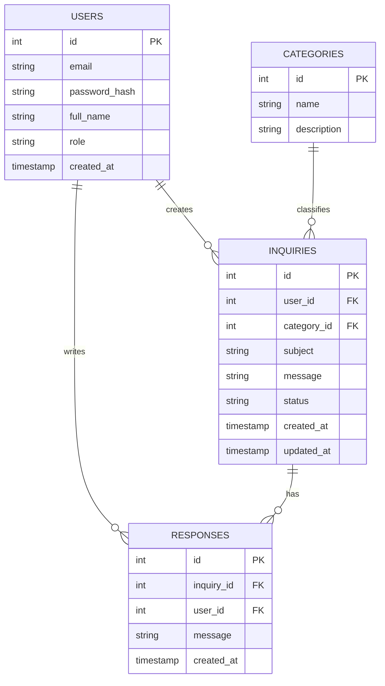

# Entity Relationship Diagram

```mermaid
erDiagram
    USERS ||--o{ INQUIRIES : creates
    USERS ||--o{ RESPONSES : writes
    CATEGORIES ||--o{ INQUIRIES : classifies
    INQUIRIES ||--o{ RESPONSES : has

    USERS {
        int id PK
        string email
        string password_hash
        string full_name
        string role
        timestamp created_at
    }

    CATEGORIES {
        int id PK
        string name
        string description
    }

    INQUIRIES {
        int id PK
        int user_id FK
        int category_id FK
        string subject
        string message
        string status
        timestamp created_at
        timestamp updated_at
    }

    RESPONSES {
        int id PK
        int inquiry_id FK
        int user_id FK
        string message
        timestamp created_at
    }
```
